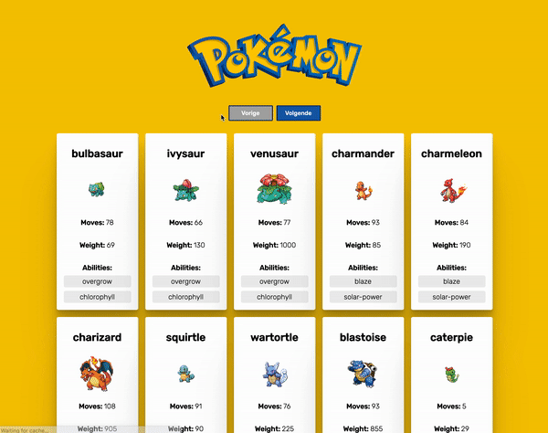

# Opdrachtbeschrijving

## Inleiding

Je bent al jaren een ontzettende Pokémon fan en kent alle afleveringen uit je hoofd. Laatst was je rustig aan het
browsen en kwam je ineens tot de ontdekking dat er een Poké API bestaat waarmee je Pokémon data mee kunt ophalen!
Jottem!

Je besluit om een applicatie te bouwen waarmee je alle Pokémons kunt bekijken, als een soort catalogus. Dat heeft vast
nog nooit iemand gemaakt!

Het project is opgezet met [Vite](https://vitejs.dev/guide/) (React versie 18.2.0).

## Eindresultaat

Focus je deze opdracht niet op styling, maar om functionaliteit. Maar omdat iedereen blij wordt van leuke kleurtjes, is
het voorbeeld toch voorzien van styling:



## De applicatie starten

Als je het project gecloned hebt naar jouw locale machine, installeer je eerst alle dependencies door het volgende
commando in de terminal te runnen:

```shell
npm install
```

Wanneer dit klaar is, kun je de applicatie starten met behulp van:

```shell
npm run dev
```

Open http://localhost:5173/ om de pagina in de browser te bekijken. Begin met het maken van wijzigingen
in `src/App.jsx`.

## Randvoorwaarden

Je gaat Pokémon data ophalen via de Poké API en deze gepagineerd weergeven. Om deze API te gebruiken heb je geen API-key
nodig. Bekijk de documentatie van de Poké API [hier](https://pokeapi.co/) en gebruik vooral hun handige data-preview
tool!

In een notendop moet de applicatie de volgende functionaliteiten bevatten:

* Bij het laden van de applicatie worden direct de eerste 20 Pokèmon uit het deck getoond;
* Elke Pokèmon(kaart) bevat een  _naam_, een afbeelding, lijst van _abilities_, _gewicht_, en de hoeveelheid _moves_ in
  het volgende format:

```shell
Ditto
[afbeelding]
Moves: 146
Weight: 55
Abilities:
   cute-charm
   competitive
   friend-guard
```

* Er bevinden zich twee knoppen op de pagina: '_Vorige_' en '_Volgende_'. Wanneer de gebruiker op '_Volgende_' klikt,
  worden de volgende 20 Pokèmon in de reeks opgehaald.
  De knoppen worden automatisch _disabled_ wanneer het begin of eind van de reeks bereikt is. De plek in de reeks moet
  dus worden bijgehouden in de state;
* De gebruiker wordt via de interface geïnformeerd wanneer er data wordt opgehaald (_loading_) of een fout is
  opgetreden (_error_);
* Wanneer de gebruiker te snel achtereenvolgens op '_Vorige_' of '_Volgende_' klikt terwijl het request nog bezig is,
  voorkom je dat er een _memory leak_ ontstaat;

_Tip:_ Laat je niet uit het veld slaan wanneer WebStorm sommige object-keys van de data die je binnenhaalt niet herkent.
Soms is WebStorm niet zo slim!

## Globaal stappenplan

1. Zorg er eerst voor dat je één Pokèmon(kaart) kunt laten zien op de pagina, zoals bijvoorbeeld JigglyPuff
2. Maak, op basis van deze code, een apart Pokèmon(kaart)-component die generiek te gebruiken is en test dit
   in `App.jsx` door zowel de informatie van _JigglyPuff_ en _Ditto_ weer te geven.
3. Ga nu eens kijken hoe je een lijst van 20 Pokèmon-namen automatisch kunt ophalen in `App.jsx` en kunt weergeven op de
   pagina. Welk endpoint heb je dan nodig? Breidt dit vervolgens uit door niet alleen de namen te laten zien, maar 20
   Pokèmon(kaart)-componenten.
4. Maak twee knoppen en bekijk de documentatie voor het ophalen van een lijst van pokémons nog eens goed. Wanneer de
   gebruiker op een knop klikt, zorg jij dat de volgende - of vorige - reeks Pokèmon worden opgehaald en weergegeven. De
   knoppen worden automatisch _disabled_ wanneer het begin of eind van de reeks bereikt is, dus houdt hier rekening mee.
5. Zorg ervoor dat alle `error` en `loading` van alle requests worden gecommuniceerd met de gebruiker.
6. Voorkom memoryleaks op alle mogelijke plekken. _Tip:_ zet `<React.StrictMode>` uit in `main.jsx` wanneer je hiermee aan
   de slag gaat, anders worden als je requests twee keer aangeroepen en vaker gecancelled dan nodig is.